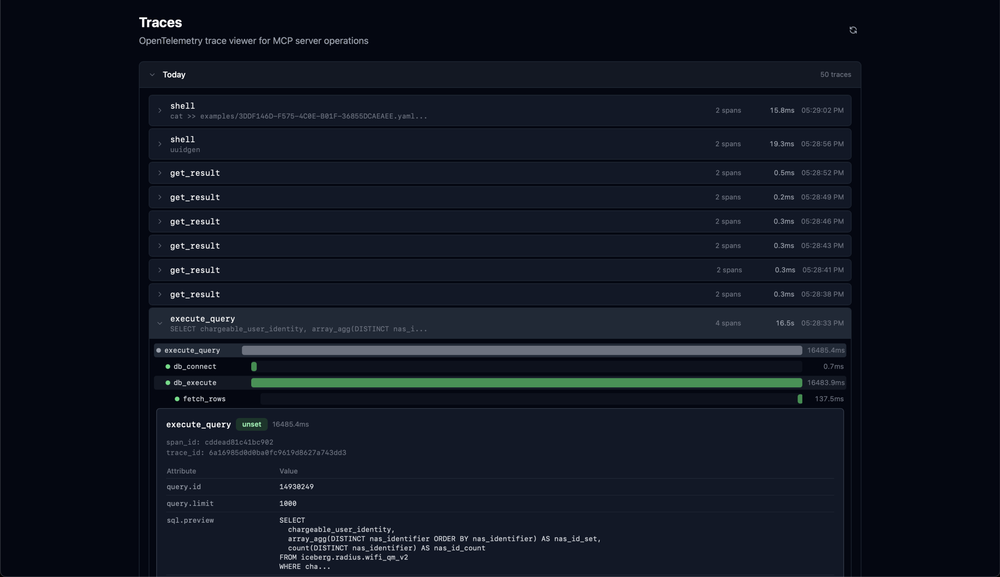
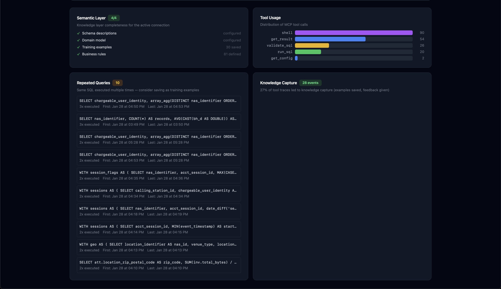

# Quickstart

Get from zero to querying your database with Claude in 5 minutes.

## Install

```bash
curl -fsSL https://download.apelogic.ai/db-mcp/install.sh | sh
```

## Set up a connection

```bash
db-mcp init mydb
```

This walks you through:
1. Picking your database type (PostgreSQL, ClickHouse, MySQL, SQL Server, Trino, DuckDB, or REST API)
2. Entering connection credentials
3. Configuring Claude Desktop to use db-mcp

That's it. Open Claude Desktop and start asking questions about your data.

## Your first query

Just ask Claude something natural:

> "What are the top 10 customers by revenue this quarter?"

Claude uses db-mcp to explore your schema, generate SQL, run it, and return results. No prompt engineering required.

## What's happening under the hood

Every connection has a **knowledge vault** — a local directory that stores everything db-mcp learns about your database:

- **Schema descriptions** — table and column documentation
- **Query examples** — natural language → SQL pairs that worked
- **SQL rules** — patterns and constraints specific to your database
- **Learnings** — error patterns, gotchas, edge cases
- **Domain model** — business context and terminology

The vault improves with every query. The more you use it, the better it gets.

```
~/.db-mcp/connections/mydb/
├── schema/descriptions.yaml
├── examples/
├── instructions/sql_rules.md
├── learnings/
├── domain/model.md
└── PROTOCOL.md
```

## Multiple databases

Have more than one database? Create multiple connections:

```bash
db-mcp init analytics
db-mcp init production
db-mcp init duckdb-local
```

List them:

```bash
db-mcp list
```

Switch the default:

```bash
db-mcp use analytics
```

Claude can also query any connection by name within a conversation — no switching needed.

## The UI

db-mcp includes a desktop app for managing your connections and monitoring query activity. Launch it from the system tray or run `db-mcp ui`.

### Context Viewer

Browse and edit your knowledge vault — schema descriptions, domain models, examples, SQL rules, and learnings. Everything the agent knows about your database, in one place.

<p align="center">
  
</p>

### Trace Viewer

OpenTelemetry-powered trace viewer for every MCP operation. See the full waterfall of each query — from tool call to database execution — with timing, SQL preview, and span attributes.

<p align="center">
  
</p>

### Insights Dashboard

Track how your semantic layer is performing. See knowledge capture rates, identify unmapped business terms, spot repeated queries worth saving as examples, and monitor validation pass rates.

<p align="center">
  
</p>

<p align="center">
  
</p>

## Useful commands

| Command | What it does |
|---|---|
| `db-mcp status` | Show config and connection status |
| `db-mcp list` | List all connections |
| `db-mcp use NAME` | Switch default connection |
| `db-mcp start` | Start the MCP server manually |
| `db-mcp console` | View live query trace activity |

## Next steps

Working with a team? Share your knowledge vault so everyone benefits from the same context. See the [Collaboration Guide](docs/collaboration.md).
