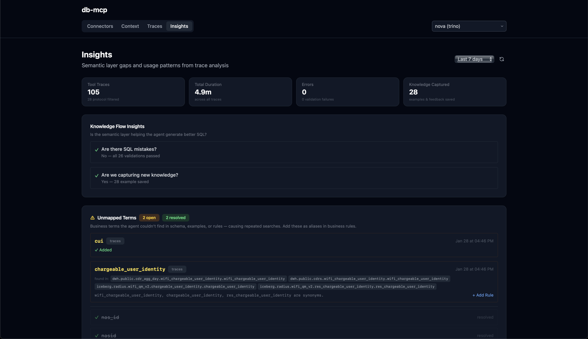
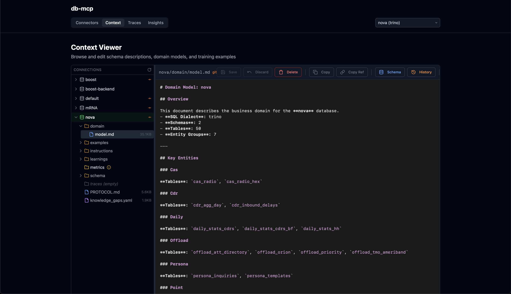

# db-mcp

**Your teams are copy-pasting company data into Claude. Give them a safe way to do it.**

db-mcp is an open-source MCP server that connects Claude Desktop to your databases—with a self-improving semantic layer that gets smarter with every query.

> No infrastructure needed. Runs locally. Data never leaves your network.

<p align="center">
  
</p>

<p align="center">
  
</p>

## Installation

```bash
curl -fsSL https://download.apelogic.ai/db-mcp/install.sh | sh
```

## Why db-mcp?

- **Ask Claude, get answers** — Stop waiting for reports. Query your data in natural language without SQL, copy-pasting schemas, or context-setting
- **Self-improving semantic layer** — Auto-generates descriptions of your schema, then learns from every query to improve accuracy over time
- **Runs on your desktop** — No cloud infrastructure, no data leaving your network. Uses your existing database credentials and access controls
- **Git-style collaboration** — Data teams review and approve semantic layer improvements. You stay in control, users get accurate answers
- **Open source & auditable** — MIT licensed, fully transparent, no vendor lock-in

## Who is db-mcp for?

| Role | Benefit |
|------|---------|
| **Business Teams** | Ask Claude questions about your data and get accurate answers instantly—no SQL required |
| **Data Teams** | Turn your warehouse into an agent-ready platform with a semantic layer that builds itself |
| **IT & Security** | Govern AI data access with full interaction history, read-only enforcement, and cost guards |

## How It Works

**From install to insight in four steps:**

1. **Install** — Download db-mcp to your laptop. No infrastructure needed—runs locally in minutes
2. **Connect** — Add data sources using your existing credentials. Your security posture stays intact
3. **Query** — Ask Claude questions across your connected data. Every query is validated before execution
4. **Improve** — The semantic layer learns from usage. Review and approve improvements with a git-style workflow

## Quick Start

```bash
# Configure your database and Claude Desktop
db-mcp init

# Check configuration
db-mcp status
```

## Supported Databases

- PostgreSQL
- ClickHouse
- Trino
- MySQL
- SQL Server

## Security & Governance

- **Runs locally** — Data stays on your machine, never routed through external servers
- **Read-only by default** — Query validation and cost guards prevent accidental data modification
- **Uses existing RBAC** — Connects with your database credentials and respects your access controls
- **Full audit trail** — Complete interaction history for compliance and debugging
- **Open source** — Fully auditable, MIT licensed

## Commands

### Setup & Configuration

| Command | Description |
|---------|-------------|
| `db-mcp init [NAME]` | Interactive setup wizard - configure database and Claude Desktop |
| `db-mcp status` | Show current configuration status |
| `db-mcp config` | Open config file in editor |

### Connection Management

| Command | Description |
|---------|-------------|
| `db-mcp list` | List all configured connections |
| `db-mcp use NAME` | Switch to a different connection |
| `db-mcp edit [NAME]` | Edit connection credentials (.env file) |
| `db-mcp rename OLD NEW` | Rename a connection |
| `db-mcp remove NAME` | Remove a connection |
| `db-mcp all COMMAND` | Run a command for all connections |

### Server & Diagnostics

| Command | Description |
|---------|-------------|
| `db-mcp start` | Start the MCP server (stdio mode for Claude Desktop) |
| `db-mcp console` | Start local trace console (view MCP server activity) |
| `db-mcp traces` | Manage trace capture for diagnostics and learning |

### Git Sync (Team Collaboration)

| Command | Description |
|---------|-------------|
| `db-mcp git-init [NAME]` | Enable git sync for an existing connection |
| `db-mcp sync [NAME]` | Sync connection changes with git remote |
| `db-mcp pull [NAME]` | Pull connection updates from git remote |

### Migration

| Command | Description |
|---------|-------------|
| `db-mcp migrate` | Migrate from legacy storage format to new connection structure |

## Configuration

Connection data is stored in `~/.db-mcp/`:

```
~/.db-mcp/
├── config.yaml                      # Global config, active connection
└── connections/{name}/
    ├── .env                         # Database credentials (gitignored)
    ├── state.yaml                   # Onboarding state
    ├── schema/
    │   └── descriptions.yaml        # Table/column descriptions
    ├── domain/
    │   └── model.md                 # Domain model documentation
    ├── training/
    │   ├── examples.yaml            # Query examples (NL → SQL mappings)
    │   └── instructions.yaml        # Custom SQL generation rules
    └── .git/                        # Optional git sync for team sharing
```

### Configuration Artifacts

| File | Purpose |
|------|---------|
| `config.yaml` | Global settings: active connection, preferences |
| `.env` | Database URL and credentials (never committed to git) |
| `state.yaml` | Onboarding progress (discovery → review → domain-building → complete) |
| `schema/descriptions.yaml` | Human-readable descriptions of tables and columns |
| `domain/model.md` | Business domain documentation for the LLM |
| `training/examples.yaml` | Known-good query examples to guide SQL generation |
| `training/instructions.yaml` | Custom rules and constraints for SQL generation |

### Environment Variables

| Variable | Description |
|----------|-------------|
| `DATABASE_URL` | Connection string (required) |
| `CONNECTION_NAME` | Override active connection |
| `CONNECTION_PATH` | Override connection directory path |
| `LOG_LEVEL` | Logging verbosity (default: INFO) |

## Development

```bash
# Clone
git clone https://github.com/apelogic-ai/db-mcp.git
cd db-mcp

# Install dependencies
uv sync

# Run locally
cd packages/core
uv run db-mcp --help

# Lint
cd packages/core && uv run ruff check . --fix
cd packages/ui && bun run lint

# Build binary
cd packages/core
uv run python scripts/build.py
```

### Testing

93 tests across three layers:

```bash
# Python unit tests (49 tests)
cd packages/core
uv run pytest tests/ -v

# UI unit tests (20 tests)
cd packages/ui
bun run test

# UI E2E tests (24 tests)
cd packages/ui
bunx playwright test
```

All tests run in CI via GitHub Actions on every push and PR. See [docs/testing.md](docs/testing.md) for the full testing guide.

### Project Structure

```
db-mcp/
├── packages/
│   ├── core/                # Main application (db-mcp)
│   ├── models/              # Shared Pydantic models (db-mcp-models)
│   └── ui/                  # Next.js control plane UI
├── docs/                    # Design documents
├── scripts/                 # Installation scripts
└── .github/workflows/       # CI/CD
```

## Roadmap

See `docs/` for design documents on planned features:
- **Metrics Layer** - Semantic metric definitions (DAU, revenue, etc.)
- **Desktop App** - Electron GUI with visual query builder
- **Knowledge Extraction** - Learn from query traces automatically
- **Data Gateway** - Unified access to multiple data sources

## Resources

- [GitHub](https://github.com/apelogic-ai/db-mcp)
- [Discord Community](https://discord.com/invite/9bsR6sU7JQ)
- [Report Issues](https://github.com/apelogic-ai/db-mcp/issues)

## License

MIT
