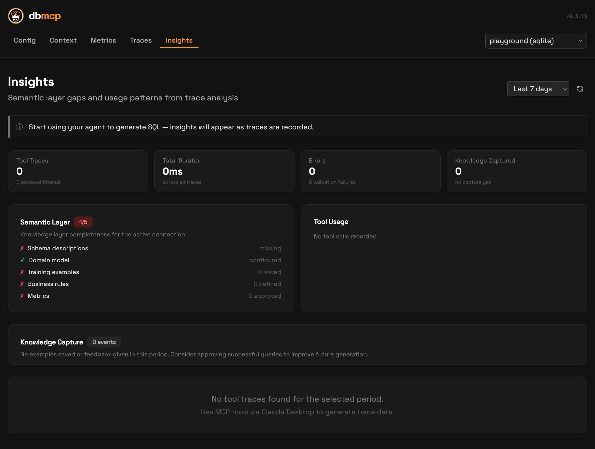
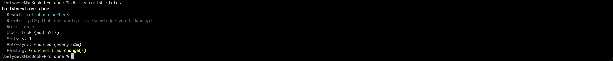

# Advanced Topics

This section covers operational and architecture-level workflows after initial setup.

## Knowledge management lifecycle

Each connection has a local knowledge vault that evolves over time:

- schema descriptions
- domain model
- examples (`NL -> SQL`)
- rules/instructions
- learnings from failures and refinements

Recommended loop:

1. Seed schema/domain via onboarding tools.
2. Approve and curate examples/rules during real usage.
3. Review gaps and insights regularly.
4. Keep connection artifacts versioned with git.

## Insights and trace-driven improvement

Enable traces to feed learning and diagnostics:

```bash
db-mcp traces on
db-mcp traces status
```

Then use:

- UI `/insights` for operational trends
- `db-mcp://insights/pending` resource for actionable items
- `dismiss_insight` / `mark_insights_processed` for workflow control

Visualization:



## Collaboration model

Team workflows are git-based, at connection scope.

Starter flow:

```bash
db-mcp git-init analytics <remote-url>
db-mcp sync analytics
```

Collaborative subgroup commands:

- `db-mcp collab init`
- `db-mcp collab attach <url>`
- `db-mcp collab detach`
- `db-mcp collab join`
- `db-mcp collab sync`
- `db-mcp collab merge`
- `db-mcp collab prune`
- `db-mcp collab status`
- `db-mcp collab members`
- `db-mcp collab daemon`

`db-mcp collab status` sample:



## Multi-connection operations

For stable behavior in mixed workloads:

- pass `connection` explicitly in tool calls
- keep `connector.yaml` present for every connection
- keep connector type/capabilities accurate
- avoid implicit defaults in long-running agent sessions

Preflight check before troubleshooting:

```bash
db-mcp doctor -c <connection>
```

## Tool mode strategy

- `detailed`: better for explicit tool orchestration and debugging.
- `shell`: better for vault-first workflows where the agent uses file context heavily.

Set in config and verify with:

```bash
db-mcp status
```

Operational guidance:

- Keep `shell` for day-to-day query sessions and faster grounding from vault files.
- Use `detailed` for onboarding, schema introspection, and structured tool debugging.

## Shell safety model

The `shell` tool is intentionally constrained:

- command allowlist (`cat`, `grep`, `find`, `ls`, `head`, `tail`, `wc`, `sort`, `uniq`, `diff`, `mkdir`, `touch`, `tee`, `echo`, `date`, `uuidgen`)
- no deletion/move/network commands
- no overwrite redirection (`>`)

This is by design to protect vault integrity and credentials.

## Migrations and compatibility

Use migration commands when upgrading legacy layouts:

```bash
db-mcp migrate
```

Migration handles:

- legacy namespace (`~/.dbmeta` -> `~/.db-mcp`)
- connection structure/version upgrades
- agent config modernization
