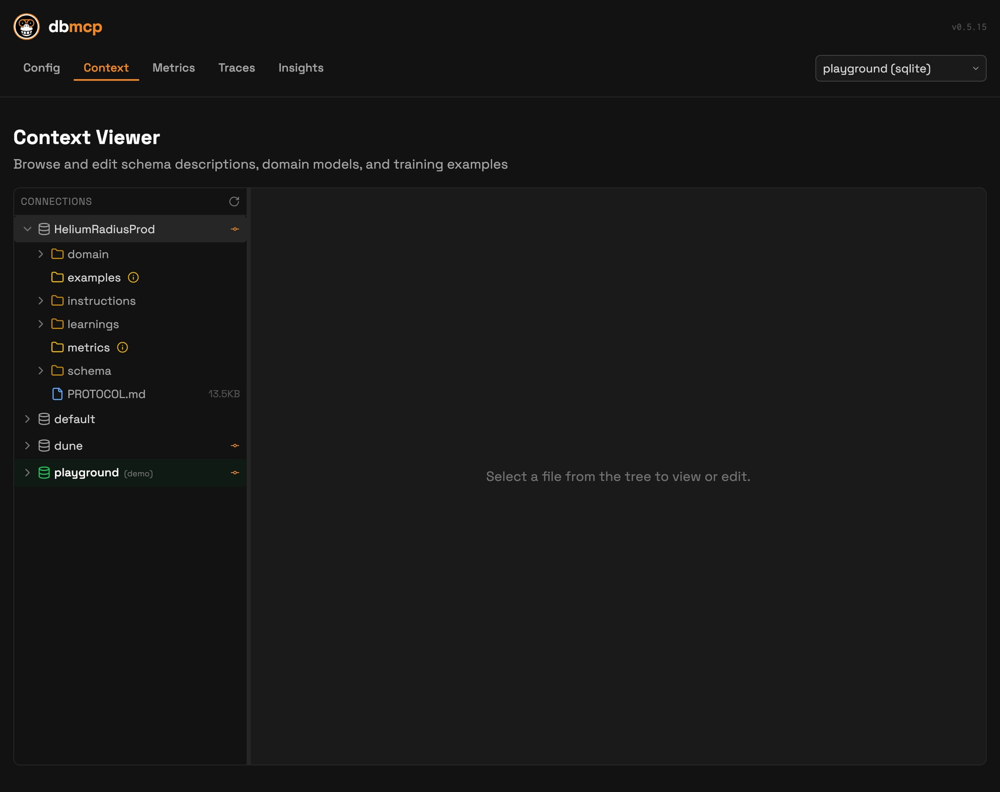

# Install and Configuration

## Installation

```bash
curl -fsSL https://download.apelogic.ai/db-mcp/install.sh | sh
```

Then verify:

```bash
db-mcp --version
db-mcp --help
```

## Configuration model

db-mcp stores global and per-connection state in `~/.db-mcp`.

```text
~/.db-mcp/
├── config.yaml
└── connections/{name}/
    ├── .env                         # credentials/secrets (gitignored)
    ├── connector.yaml               # connector type, profile, capabilities (see Connector Profiles)
    ├── PROTOCOL.md                  # system-managed agent protocol
    ├── state.yaml                   # onboarding progress/state
    ├── state/
    │   └── protocol_ack.json        # protocol acknowledgment marker (auto-managed)
    ├── knowledge_gaps.yaml          # detected/resolved term gaps (created when used)
    ├── feedback_log.yaml            # SQL feedback history (created when used)
    ├── .insights.json               # pending insights queue (created when used)
    ├── schema/
    │   └── descriptions.yaml
    ├── domain/
    │   └── model.md
    ├── instructions/
    │   ├── sql_rules.md
    │   └── business_rules.yaml
    ├── examples/
    │   └── *.yaml
    ├── learnings/
    │   ├── patterns.md
    │   ├── schema_gotchas.md
    │   └── failures/*.yaml
    ├── metrics/
    │   ├── catalog.yaml
    │   └── dimensions.yaml
    ├── traces/{user_id}/*.jsonl     # when traces are enabled
    └── .collab.yaml                 # when collaboration is initialized
```

See [Connector Profiles](connector-profiles.md) for details on `connector.yaml` structure, profiles, and the versioned contract.

## `connector.yaml` vs `.env`

Use both:

- `connector.yaml` describes connector type and behavior (`sql`, `api`, `file`, `metabase`, capabilities, metadata).
- `.env` stores secrets and credentials (for SQL usually `DATABASE_URL`).

Notes:

- `connector.yaml` is the canonical connector manifest for db-mcp.
- For plain SQL, db-mcp can fall back without `connector.yaml`, but adding it is recommended for consistent multi-connection behavior.

Minimal SQL example:

```yaml
type: sql
dialect: postgresql
description: Primary analytics warehouse
```

Minimal API example:

```yaml
type: api
base_url: https://api.example.com
auth:
  type: bearer
  token_env: API_TOKEN
```

## Create and manage connections

```bash
db-mcp init mydb
db-mcp list
db-mcp use mydb
db-mcp edit mydb
db-mcp remove mydb
```

## Important environment variables

- `DATABASE_URL`: database connection URL (usually from connection `.env`)
- `CONNECTION_NAME`: active connection name
- `CONNECTION_PATH`: active connection directory
- `CONNECTIONS_DIR`: base directory for all connections
- `LOG_LEVEL`: runtime logging level
- `TOOL_MODE`: MCP tool exposure mode (`detailed` or `shell`)
- `DB_MCP_REQUIRE_PROTOCOL_ACK`: when set to `true`, requires agents to read `PROTOCOL.md` before executing SQL
- `DB_MCP_PROTOCOL_ACK_TTL_SECONDS`: how long a protocol acknowledgment stays valid (default: 6 hours)

## Validate setup

```bash
db-mcp status
db-mcp discover -c playground
```

Expected validation signals:

- `db-mcp status` shows an active connection and credentials.
- `db-mcp discover` returns schema data (catalog/schema/table/columns).

`db-mcp status` sample:


`db-mcp discover -c playground` sample:


## UI check

Use the Setup page (`/config`) to verify connection settings and agent integration:


Use the Knowledge page (`/context`) to confirm schema/domain/examples/rules files are present:



If setup looks good, continue to [Using the CLI](using-cli.md) and [Working with Agents](working-with-agents.md).
