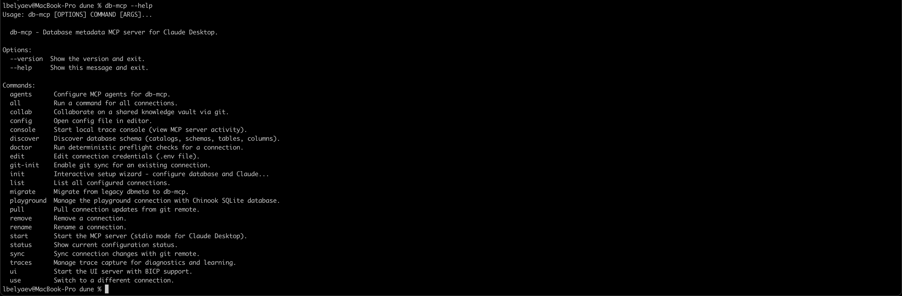
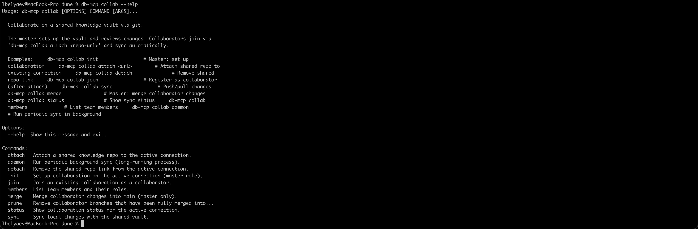
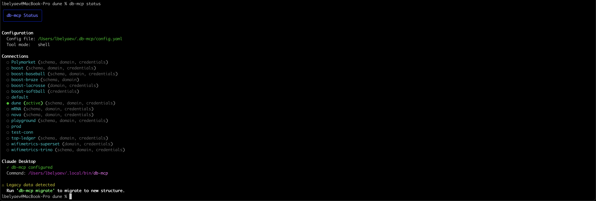
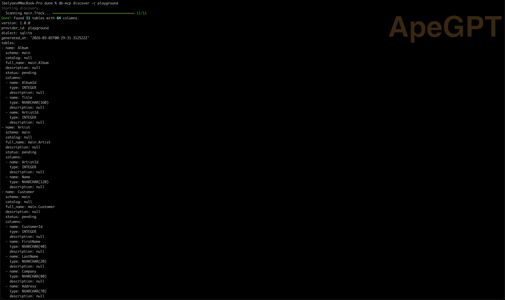
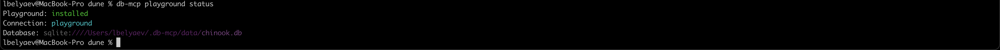
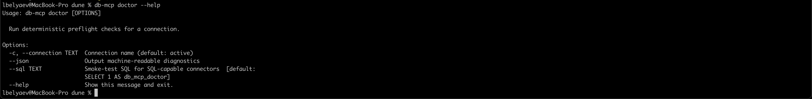
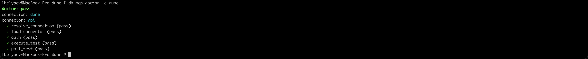

# Using the CLI

The `db-mcp` CLI is the primary way to create connections, run services, and manage collaboration flows.

## Core lifecycle

```bash
db-mcp init mydb
db-mcp status
db-mcp start
```

Default behavior:

- `init` sets `tool_mode` to `shell` by default.
- `start` runs MCP over stdio for agent clients.

## Common commands

### Connection management

- `db-mcp list`
- `db-mcp use NAME`
- `db-mcp edit [NAME]`
- `db-mcp rename OLD NEW`
- `db-mcp remove NAME`
- `db-mcp all COMMAND`

### Service commands

- `db-mcp start`
- `db-mcp ui`
- `db-mcp console`
- `db-mcp playground install`
- `db-mcp playground status`

### Agent integration

- `db-mcp agents`
- `db-mcp agents --list`
- `db-mcp agents --all`
- `db-mcp agents -A claude-desktop -A codex`

### Discovery and diagnostics

- `db-mcp discover --connection NAME`
- `db-mcp discover --url <database_url>`
- `db-mcp doctor -c NAME`
- `db-mcp traces on`
- `db-mcp traces off`
- `db-mcp traces status`

### Git and team sync

- `db-mcp git-init [NAME] [REMOTE_URL]`
- `db-mcp pull [NAME]`
- `db-mcp sync [NAME]`

### Collaboration group

- `db-mcp collab init`
- `db-mcp collab attach <repo-url>`
- `db-mcp collab detach`
- `db-mcp collab join`
- `db-mcp collab sync`
- `db-mcp collab merge`
- `db-mcp collab prune`
- `db-mcp collab status`
- `db-mcp collab members`
- `db-mcp collab daemon`

## Practical workflows

### Solo workflow

```bash
db-mcp init analytics
db-mcp status
db-mcp agents --all
# query from your agent client
db-mcp traces status
```

### Team contributor workflow

```bash
db-mcp init analytics git@github.com:your-org/db-mcp-analytics.git
db-mcp collab join
# query from your agent client
db-mcp collab sync
db-mcp collab status
```

### Master reviewer workflow

```bash
db-mcp collab merge -c analytics
db-mcp collab members -c analytics
db-mcp collab prune -c analytics
```

## Typical daily workflow

```bash
# Start your day
db-mcp pull analytics
db-mcp use analytics
db-mcp status

# Work with your agent
# ...ask queries in agent...

# Capture and share updates
db-mcp traces status
db-mcp sync analytics
```

## Example CLI output

`db-mcp --help` includes these command groups:

- `agents`, `collab`, `discover`, `traces`
- `init`, `start`, `status`, `ui`, `console`, `doctor`
- `git-init`, `pull`, `sync`, `migrate`

`db-mcp collab --help` includes:

- `attach`, `detach`, `join`, `sync`, `merge`, `prune`, `status`, `members`, `daemon`

## Help and command introspection

```bash
db-mcp --help
db-mcp <command> --help
db-mcp collab --help
db-mcp traces --help
```

## CLI output gallery

Main command help:



Collaboration help:



Agent setup (interactive):


Agent detection list:


Global status:



Schema discovery sample:



Playground connection status:



Collaboration status sample:


Doctor help:



Doctor preflight pass sample:


