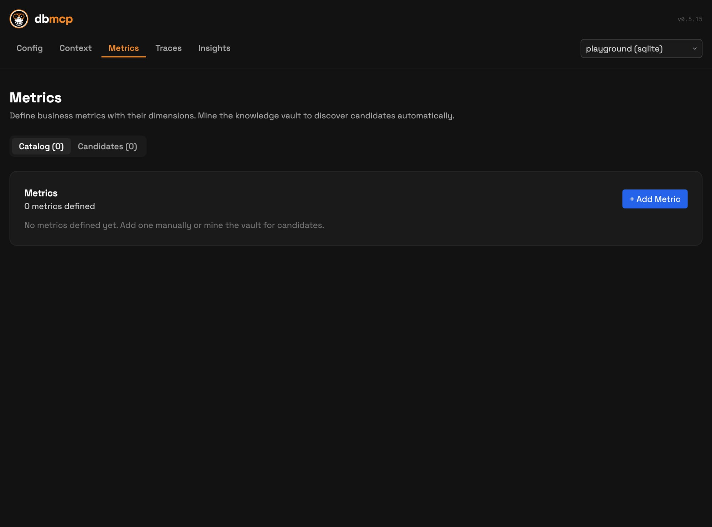

# Using the Web UI

The Web UI is your operator console — a single place to manage connections, inspect what your agents have learned, track query patterns, and debug tool calls.

## Start the UI

```bash
db-mcp ui
```

Optional flags:

```bash
db-mcp ui -p 8080       # custom port
db-mcp ui -c mydb        # open with a specific connection
db-mcp ui -v             # verbose logging
```

## Main screens

### Config (`/config`)

Manage everything about your connections and agent integrations in one place.


From here you can:

- Create, edit, and delete database, file, and API connections
- Test connectivity and run schema discovery
- Set the active connection
- Configure which agents (Claude Desktop, Claude Code, Codex, OpenClaw) have db-mcp access

### Context (`/context`)

Browse and edit the knowledge artifacts that db-mcp and your agents have built up over time — this is the institutional memory that makes every query smarter than the last.


The tree view organizes artifacts by connection:

- **Schema** — table and column descriptions
- **Domain** — business domain model
- **Examples** — approved NL→SQL pairs that guide future generation
- **Instructions/Rules** — business logic constraints
- **Learnings** — patterns captured from past failures and refinements

### Metrics (`/metrics`)

Define and manage your business metric catalog. db-mcp can also mine the knowledge vault to discover metric candidates automatically.



Use this to:

- List approved metrics and dimensions
- Discover candidates from vault artifacts
- Approve, edit, or remove entries

### Traces (`/traces`)

A built-in OpenTelemetry trace viewer for every MCP tool call your agents make.


Traces give you full visibility into:

- Live and historical tool call lists
- Span drill-down with timing and error inspection
- Which queries succeeded, failed, or needed refinement

### Insights (`/insights`)

The insights dashboard connects traces to knowledge gaps — showing you where your semantic layer is strong and where it needs work.


Key panels:

- **Semantic Layer completeness** — schema descriptions, domain model, training examples, business rules, metrics
- **Tool Usage** — which tools agents call most
- **Knowledge Capture** — examples saved and feedback given
- **Trace analysis** — patterns from recent agent activity

## Operational notes

- `db-mcp ui` starts a local FastAPI service and opens your browser automatically.
- UI actions operate on the same connection state used by CLI and MCP server — changes are reflected everywhere.
- For clean shutdown, stop with `Ctrl+C`.
