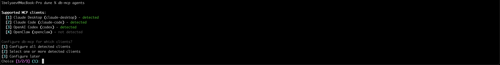
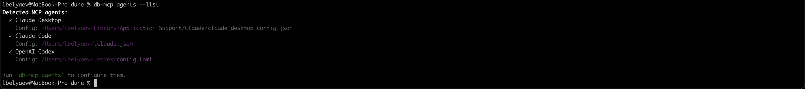
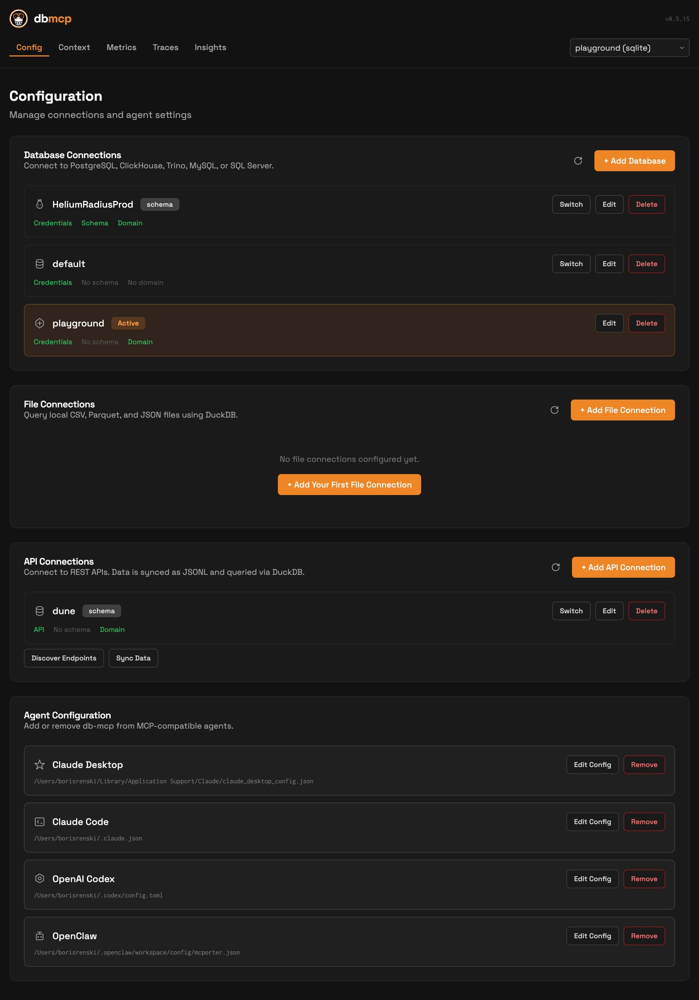
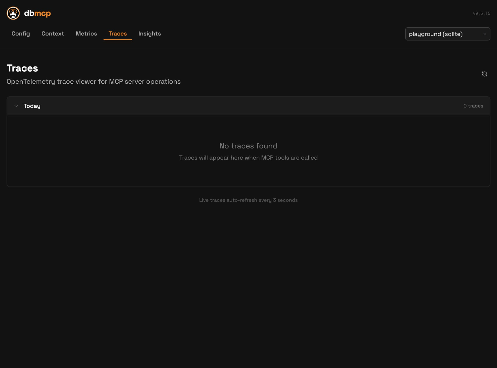

# Working with Agents

db-mcp integrates with MCP-capable clients and writes server config into each client's native config file.

## Supported agents

- Claude Desktop
- Claude Code
- OpenAI Codex
- OpenClaw (via `mcporter`)

## Recommended setup

```bash
db-mcp agents
```

Useful variants:

```bash
db-mcp agents --list
db-mcp agents --all
db-mcp agents -A claude-desktop -A codex
```

Interactive setup sample:



Detected clients sample:



## Recommended rollout order

1. Run `db-mcp agents --list` and confirm detected clients.
2. Run `db-mcp agents --all` (or target specific clients with `-A`).
3. Restart each configured client.
4. Verify with `db-mcp status` and `db-mcp traces status`.

## What configuration is written

Each agent gets a `db-mcp` entry with:

- `command`: `db-mcp`
- `args`: `["start"]`

Legacy `dbmeta` entries are removed when applicable.

## Config file locations

### Claude Desktop

- macOS: `~/Library/Application Support/Claude/claude_desktop_config.json`
- Windows: `%APPDATA%\\Claude\\claude_desktop_config.json`
- Linux: `~/.config/Claude/claude_desktop_config.json`

### Claude Code

- `~/.claude.json`

### OpenAI Codex

- `~/.codex/config.toml`

### OpenClaw

- `~/.openclaw/workspace/config/mcporter.json`

## Manual snippets

### JSON-based clients

```json
{
  "mcpServers": {
    "db-mcp": {
      "command": "db-mcp",
      "args": ["start"]
    }
  }
}
```

### Codex TOML

```toml
[mcp_servers.db-mcp]
command = "db-mcp"
args = ["start"]
```

## Detection notes

- Detection uses config existence and/or CLI availability.
- On Windows, detection includes `%LOCALAPPDATA%\\Programs\\Claude\\Claude.exe` and common `Program Files` paths.
- If auto-detection misses your install, you can still configure manually.

## Verify integration

1. Run `db-mcp status` and confirm agent config appears.
2. Restart your agent client.
3. Trigger a simple MCP call (for example ask a question that hits `ping`/`list_connections` paths).
4. Confirm activity under `db-mcp traces status` or UI `/traces`.

## UI validation

Use `/config` to confirm connection and agent setup visually:



Use `/traces` to validate real tool activity after restart:


